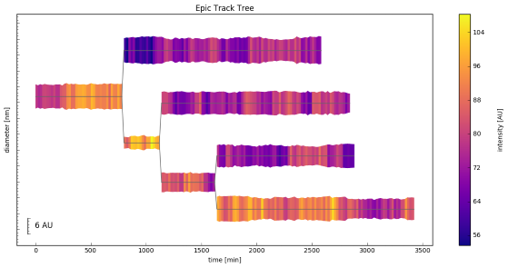
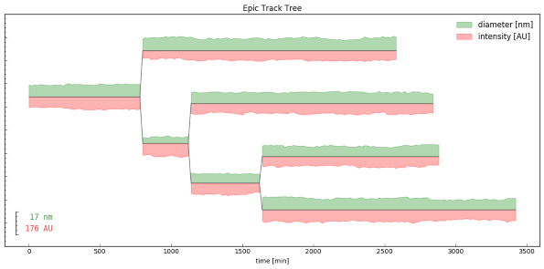

# Track Tree - Epic Tree Timecourse Visualization

by Jonas Hartmann, Gilmour group, EMBL Heidelberg

----

**Info:**

This pipeline reads time course data of a tracked object that divides into multiple objects over time (for example a cell as observed with a fluorescence microscope and tracked by image analysis) and plots the track data as a tree, visualizing measurements as an outline and/or through coloring.

See `About` section in `track_tree.ipynb` for more information!

----

**Example 1:** Tree with outline and color to represent track measurements

**Example 2:** Example tree with two outlines to represent track measurements

